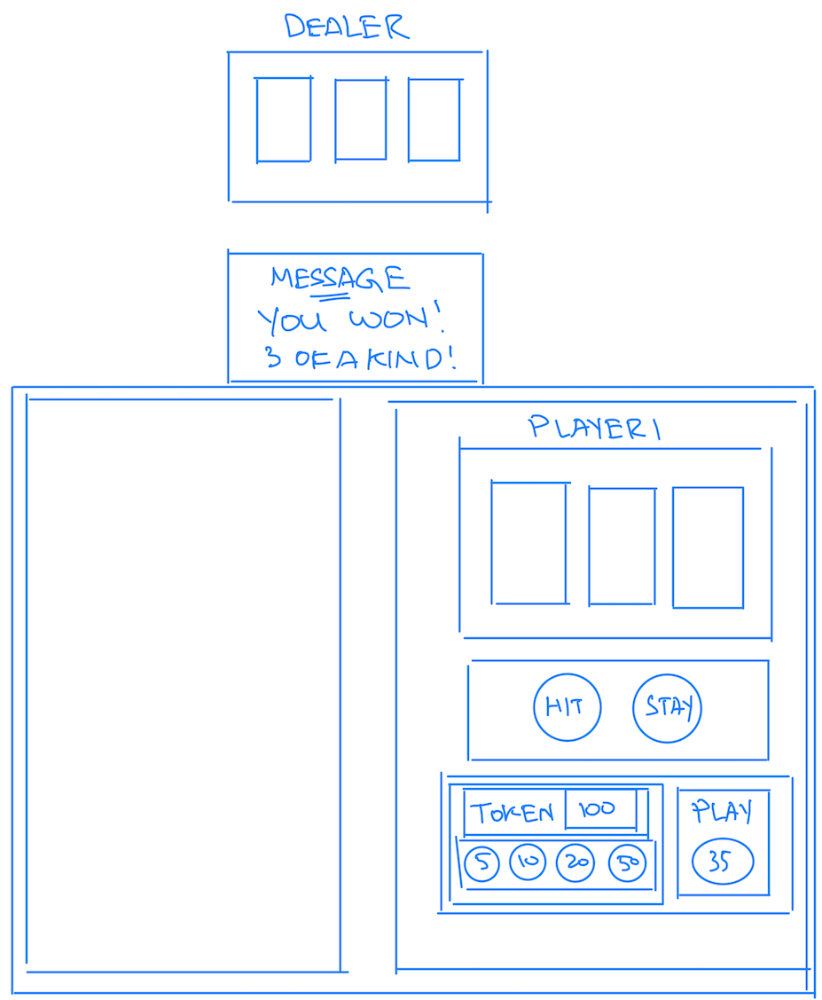
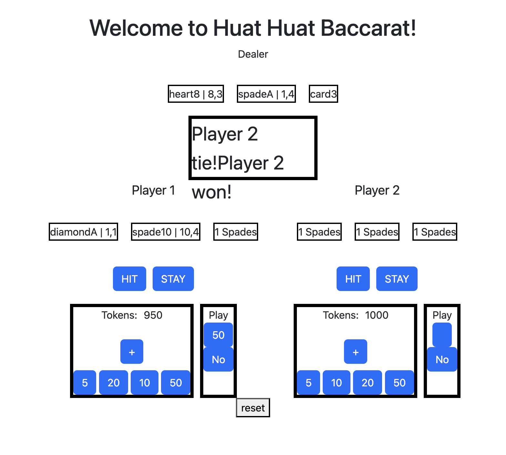

# Project 1: Baccarat

---

## Introduction

This is game is created based on HTML, CSS and JAVASCRIPT.

I'm going to share in few phases

- Planning stage
- Process of coding the game

---

## Planning stage

### User Experience

First, from the user point of view, I wrote out what an user would experience while playing.

1. Start to click and play

2. Issing cards to players

   - First cards issued to players and banker
   - Second cards and stop.
   - Last card is empty
   - Annoucement of results if have winning cards at this stage.

3. If no winning cards yet, players need to decide if the cards they have are >= 5, they have few courses of action.

   - if < 5 will auto issue card
   - hit: get another cards
   - stay: not get another cards.

4. After that reveal results and payout tokens

5. Continue to play or exit.

---

### Rules of the games

- When first 2 cards are dealt.

  - if the digit at the ones of 2 cards total is 9 or 8 means won.
  - if banker wins with 2 cards, game ends.
    - **_Winning conditions 1_**
      - 2 cards
        - 9 > 8
        - same dight && same suites > same digit > same suites
  - if banker didnt win by 9 or 8, game continues

- When 3rd card is dealt

  - if the digit at the ones of 2 cards total less than 4 means have to hit.
  - Otherwise, player can choose
    - hit or,
    - stay.
  - banker will only hit if less than 4, otherwise stay.

- Game ends and check for winning conditions
  - if same score, it's a tie.
  - after 2nd or 3rd card: the digit at the ones of 2 or 3 cards total
    - 9 being the Highest; higher than bank means win
      - **_Collate scores: winning conditions 2_**
        - Spades > heart > club > diamond
        - 2 cards (lowest tier)
          - same dight && same suites > same digit > same suites
        - 3 cards (highest tier)
          - same suites && consecutive (lowest must start from 1) > same digit && same suites > same suites > consecutive
            - same suites && consective Q K A > 1 2 3
            - same digit && same suites A A A > 10 10 10

---

### Pseudocodes

1. Define variables

   - Dealer's cards
   - Dealer's cards value
   - Messages
   - Player 1's cards
   - Player 1's card value
   - Player 1's action selection
   - Player 1's current token amount
   - Player 1's total token playing amount
   - Which players' turn now

2. Define constants

   - Card pictures to each card array
   - Cards odds

3. Define functions

   - Add token amount to play button

   - Click play button to trigger random distributions of card

     - distributes card by waves
     - update the html cards
     - auto trigger winning conditions 1
       - exit for those who already won
     - update the scores
     - update message
     - continue for those who still in the game
       - to select hit or stay
       - if < 5 and didnt press hit, will auto given a card

   - auto trigger winning conditions 2

     - update the scores
     - update message

---

### Event flow

- player2TokenSelection()

  - adds token to play button
  - cannot exceed the player2TotalToken's range

- click on #player1PlayButton or #player2PlayButton

  - player2Play()
    - if player2PlayingStatus "" means its the start
    - if already issued 2 cards then it's in the midst of the game
    - if no more tokens then change status to noPlay
    - then check on another play if already selected play or noPlay
    - if both playingStatus have been updated, proceed with gameStart()

- click on #player1NoPlayButton or #player2NoPlayButton

  - if player1 noPlay, then **turn** will fixed to the other player
  - to change player2playingStatus to noPlay so that player2Play() can proceed to gameStart()

- gameStart() trigger by #player1PlayButton or #player2PlayButton

  - if playingStatus === play
    - randomlyDealCard()
    - update cards array
    - update card value array & suites array
    - update card picture
  - if both players' playingStatus is filled
    - dealer will issue dealer's cards.
  - immediately tallyResults2Cards()

- tallyResults2Cards()

  - if player1 has 9/8 and dealer has 9/8, tie
    - otherwise, player1 with 9/8 wins and tally score
    - update player1TotalToken based on odds and player1CurrTokenAmt
    - update **player1ResultStatus**
  - But if dealer has 9/8, then player 1 loses
    - if odd = 1 then no action needed
    - if odd >1 then deduct more from the TotalTokens
    - update **dealerP1ResultStatus** = "won"
  - if dealer wins both sides then endGame()
  - Update turns here.

- click on player1HitButton to trigger midGame()

  - if player1 didnt win with 2 cards then can decide to hit or stay
    - if hit, he will get next card
    - if stay, he might still get the next card if his score is below 5.
    - either way, he will update the HitOrStay variable.
  - update dealer's cards
  - trigger tallyResults3Cards() when conditions met for how many players are playing and what are their current status.

- tallyResults3Cards()
  - Check players and dealer have the same results, if yes it's a tie.
  - Otherwise check which party has higher results than the other.
  - Then check for odds to tabulate token payout to each players.
  - once finished, endGame();

---

## Process of coding the game

### Creating of HTML elements

- Drew out the layout of the website by thinking of the element tags
- Structured the layout in terms of flexbox pattern to:
  - flex-direction: column; or
  - flex-direction: row;
- Hence, it is to think of which squares are within which squares.

---

### Writing of codes in JavaScripts

- Based on the pseudocodes, write out the variables and functions.
- Most difficult parts are actually the coding of the winning conditions for each player.

---

### Beautify the website via CSS.

- In general i used 5 different areas to style this website
  - General styling via style.css methods
  - Flexbox to align all boxes center
  - Gridbox to fix all the boxes at their required positions
  - Use bootstrap to create the buttons
  - Finally, style instructions using `` within each element.

---

## Final results!

Please enjoy the game and hope that you liked it!
